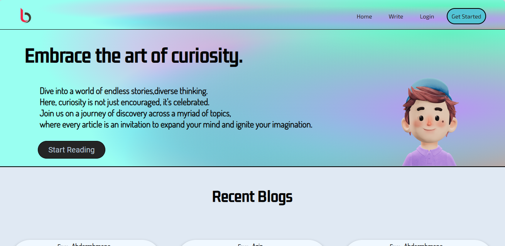
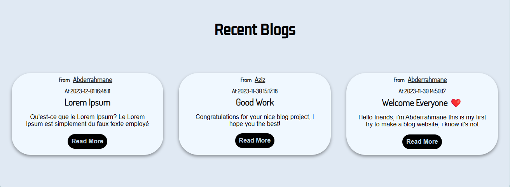

# Blogify - Your Platform for Expressive Writing

Blogify is a simple and elegant blog website built with HTML, CSS, JavaScript, and Python Flask. This web application allows users to create, delete blog posts, as well as view and comment on posts.

## Table of Contents

- [Introduction](#introduction)
- [Deployment](#deployment)
- [Installation](#installation)
- [Usage](#usage)
- [Contributing](#contributing)
- [Related Projects](#related-projects)
- [Licensing](#licensing)
- [Screenshots](#screenshots)

## Introduction

Blogify enables users to register, log in, and manage their accounts securely. With features such as creating blog posts and an interactive commenting system, Blogify offers a responsive design for an optimal user experience across various devices.

### Project Links
- [Deployed Site](http://blog-ify.tech/)
- [Final Project Blog Article](#)
- Author LinkedIn:
  - [Abderrahmane Fethi](https://www.linkedin.com/in/abderrahmane-fethi/)

## Deployment

Visit the deployed site [here](http://blog-ify.tech/) to start your blogging journey with Blogify. For a detailed overview of the project, read our [final project blog article](#).

## Installation

To run Blogify locally, follow these steps:

1. Clone the repository:
    ```bash
    git clone https://github.com/A-fethi/Blogify.git
    ```

2. Navigate to the project directory:
    ```bash
    cd Blogify
    ```

3. Run the application:
    ```bash
    python app.py
    ```

4. Access Blogify in your web browser at `http://localhost:5000`.

## Usage

- **User Authentication:** Register, log in, and manage your account securely.
- **Create Posts:** Share your thoughts by creating new blog posts.
- **Comment System:** Engage with readers through the built-in commenting system on each blog post.
- **Responsive Design:** Enjoy a seamless blogging experience on various devices.

## Contributing

We welcome contributions to enhance Blogify. To contribute, please follow our [Contribution Guidelines](CONTRIBUTING.md).

## Related Projects

Explore other projects by our team:
- [Blogify Landing-Page](https://a-fethi.github.io/Blog-ify/)

## Licensing

This project is licensed under the [MIT License](LICENSE).

## Screenshots

- 
- 

Happy Blogging with Blogify! 🚀
